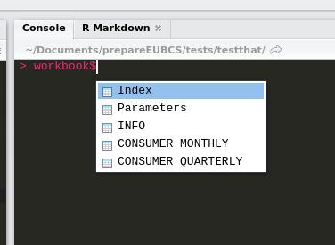

`broTools` is a package that includes some useful functions to make the life of the DMD at 
STATEC easier. Here is the list of the included functions:

* `all_data_to_upper()`
* `modal_value()`
* `multi_join()`
* `read_list()`

### Change the letter case of the column names of a list of datasets to uppercase with `all_data_to_upper()`

This function changes the letter case of the column names of the datasets stored in a list to 
upper case. This is useful for merging datasets with the same column names, but with different 
letter cases.

### Get the mode a list of number or characters thanks to `modal_value()`

As surprising as it may seem, R does not have a function to compute the mode of a list of 
observations. This function solves this, but the implementation is very basic for now. For example
in the case of a tie, it only returns the first of the two modes.

### Join a list of datasets into one single dataset using `multi_join()`

`multi_join()` solves the problem of merging a lot of datasets together. It takes a list of datasets
as an input, and outputs a `tibble` (an enhanced version of base R's `data.frames`).

### Check if x is around y with `around()`

If x > y - eps and x < y + eps, `around()` returns `TRUE`, if not, `FALSE`.

### Read an Excel workbook with `read_workbook()`

`read_workbook()` reads an `.xlsx` file into R. It is a wrapper around various pre-existing
functions. The only argument of `read_workbook()` is a path to an `.xlsx` file. The output is a
list where each element is a `data.frame` object representing each one of the sheets in the `.xlsx`
file. So for instance, a `.xlsx` file with four sheets, named `sheet1`, `sheet2`, `sheet3` and
`sheet4`, gets imported into R in a named list where the first element is a `data.frame` named also
`sheet1` and containing the data from `sheet1`, the second element, ... etc. If one loads the data
into a variable called `workbook`, here is what it looks like:

### Read a lot of datasets at once easily with `read_list()`

`read_list()` works by giving it a list of datasets in your current working directory and a read
function, such as `readr::read_csv()` in case you want to read `.csv` files and puts them in a 
list. You can then use the above functions on this list of datasets.

